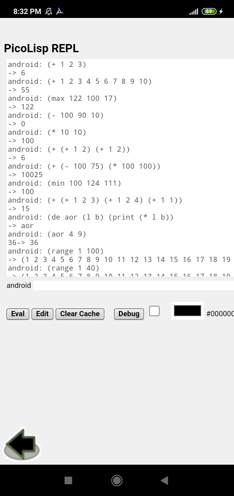
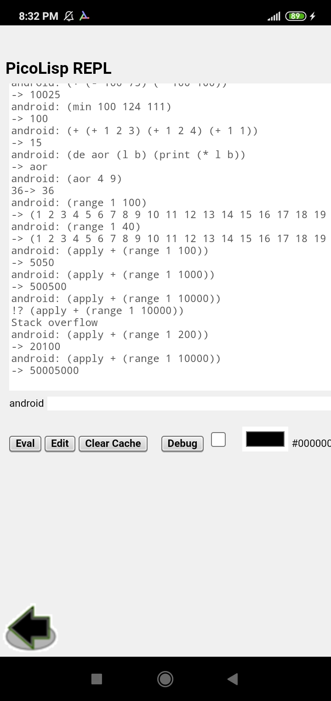

# Agastyamuni Educational Activities

Latest on top. 

Four students. Ages: 12-16 Years

## 2022-04-29
1. Pilbox. Picolisp Introduction. Introduction to basic functions. Arithmetic. Nested lists. Summation of numbers from 1-100. _max_. _min_. 
2. Ayurveda. Naturopathy. _Timru_. Teeth health. 
3. Mind mapping introduction. 
4. Discussion regarding child's health. Cure through _meditation_ and _yoga_. 
5. Mind mapping live demonstration while Holistic Life Management. 
6. Life journey discussion and understanding. 

Picolisp on Pilbox: 

