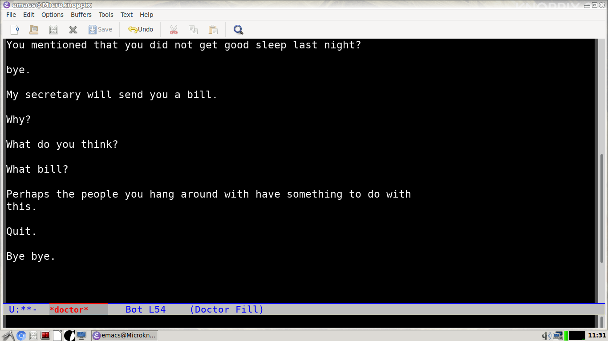
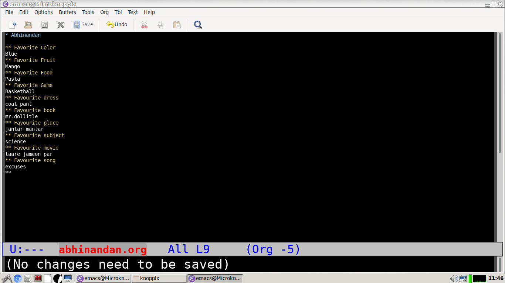
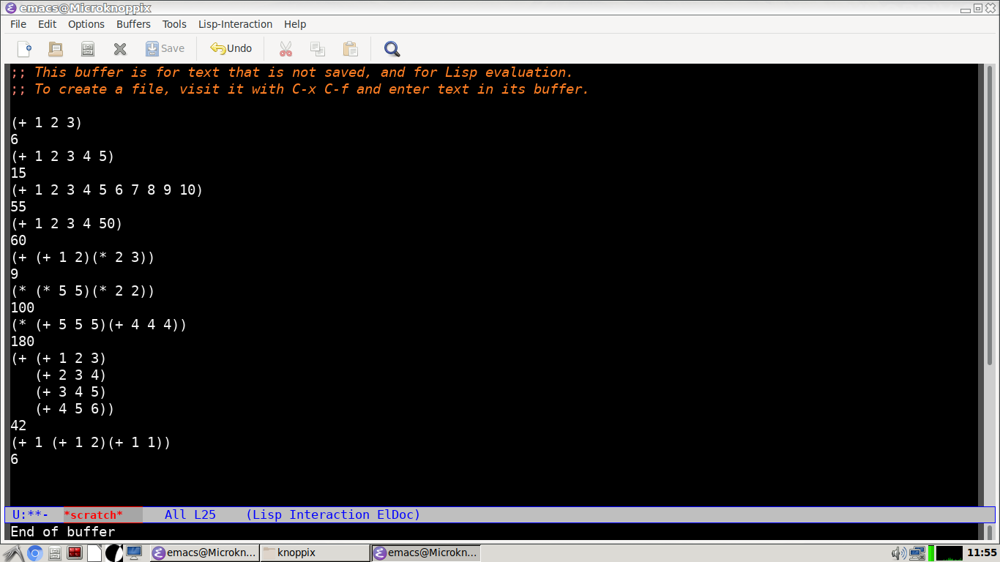
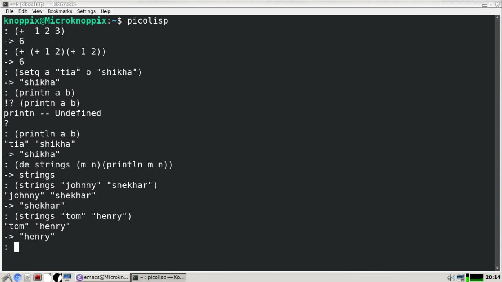
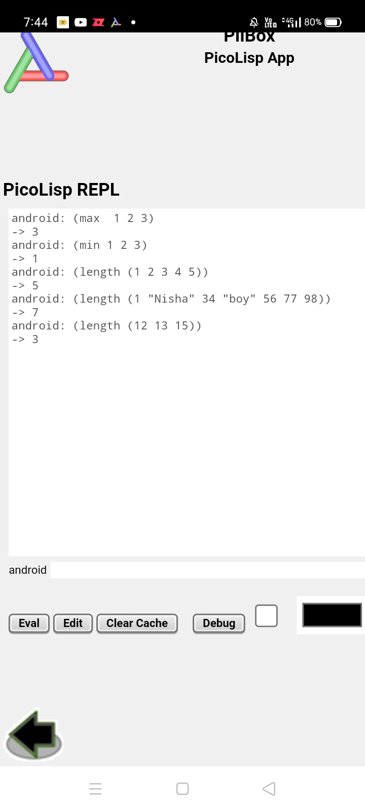
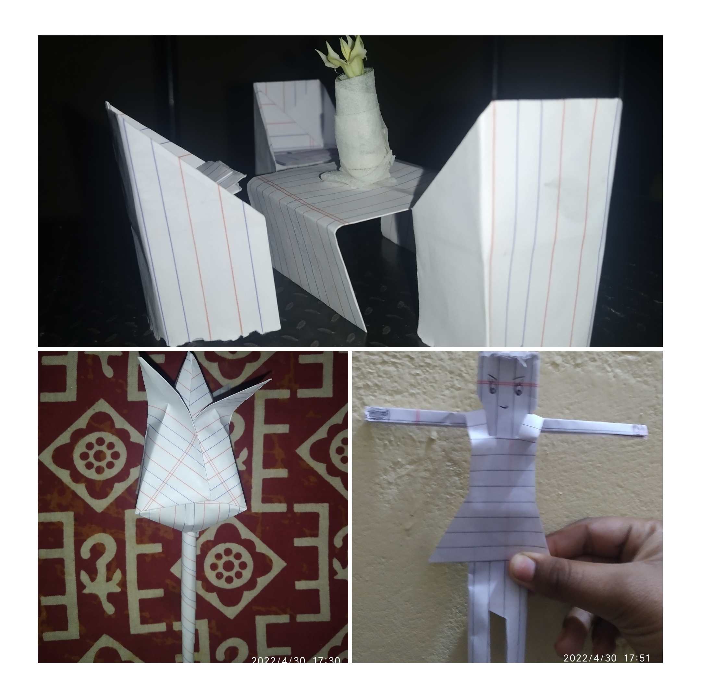

# Agastyamuni Educational Activities

Latest on top. 

Four students. Ages: 12-16 Years

## 2022-05-01
1. Yoga asanas on a big rock on the banks of Mandakini. 

## 2022-04-30
1. Short trek in morning. 
2. Farm consulting to an elder.
3. Emacs intro. Org mode intro. Scratch buffer. 
4. Exploring Game section in Emacs and Knoppix. 
5. Origami: Lotus, Doll, Dining Set
6. Educative movies with children: 
    - [Fun with Magnets](https://m.youtube.com/watch?v=Jio7yyXo3Aw) 
    - [Turning Trash into toys for learning](https://m.youtube.com/watch?v=KnCqR2yUXoU)
    - [Do Flowers Fly?](https://m.youtube.com/watch?v=qhFueNOJyCU)
    - [Ferdinand, the Bull](https://m.youtube.com/watch?v=UN62cxSs5Q8)
    - [Bamboo ideas in farming & utensils](https://m.youtube.com/watch?v=oi38cQMORQY)
    - [Usage of Rose 🌹: Candies, Cake, Jam, Syrup etc](https://m.youtube.com/watch?v=OSX3ik9Z4X8)
7. Picolisp installation. [Steps](picolisp-code.org) slightly more in this machine. 
8. Picolisp _length_ function discussion. 

**Emacs Psychotherapist** 

**Emacs Orgmode**

**Scratch Buffer**

**Picolisp testing after Installation**

**Pilbox on Student's phone**

**Origami Session**

## 2022-04-29
1. Pilbox. Picolisp Introduction. Introduction to basic functions. Arithmetic. Nested lists. Summation of numbers from 1-100. _max_. _min_. 
2. Ayurveda. Naturopathy. _Timru_. Teeth health. 
3. Mind mapping introduction. 
4. Discussion regarding child's health. Cure through _meditation_ and _yoga_. 
5. Mind mapping live demonstration while Holistic Life Management.
6. Art techniques. 
7. _Gainthi_ sowing. 
8. Life journey discussion and understanding. 

**Picolisp on Pilbox:** 

